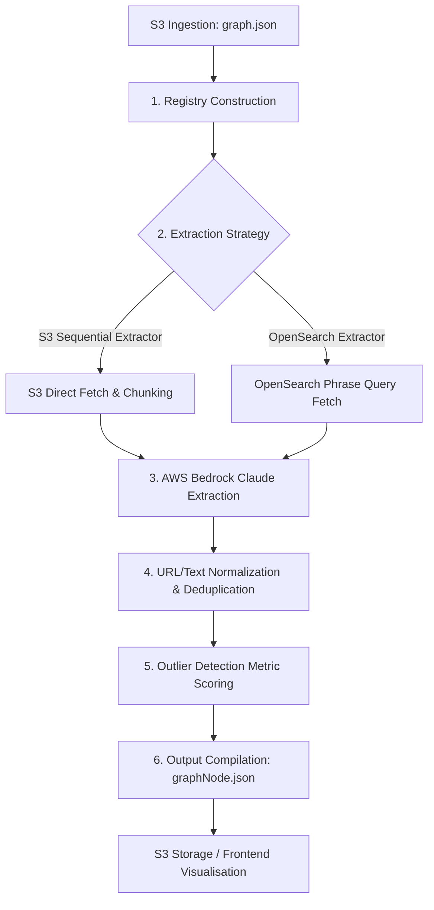

# Developer Setup and Operations Runbook

This runbook guides developers through configuring, running, testing, and troubleshooting the GOV.UK AI Graph Tools application locally and in containerized environments.

---

## 1. Prerequisites & Tooling

To develop, run, and test this project locally, ensure you have the following installed:

*   **Python:** Version `3.12` or `3.13` (matching the production Docker image).
*   **uv:** Fast Python package installer and resolver. Install via pip:
    ```bash
    pip install uv
    ```
*   **Docker:** For containerized local runs.
*   **AWS CLI:** Confirmed access to AWS Bedrock and AWS S3 buckets.

---

## 2. Local Setup & Installation

Follow these steps to set up your local development environment:

1.  **Clone the Repository:**
    ```bash
    git clone <repository_url>
    cd content_extractor_s3
    ```

2.  **Synchronize Dependencies:**
    Initialize the virtual environment and install all packages using `uv`:
    ```bash
    uv sync
    ```

3.  **Install Git Pre-Commit Hooks:**
    Activate standard code quality and formatting checks on commit:
    ```bash
    make install-hooks
    ```

---

## 3. Configuration & Secrets (`.env`)

Create a `.env` file in the root of the project directory. Copy and configure the following template:

```env
# Server Port Configuration
PORT=3000

# AWS Credentials (Ensure your local CLI is logged in)
AWS_REGION=eu-west-2
AWS_DEFAULT_REGION=eu-west-2
AWS_ACCESS_KEY_ID=your_access_key
AWS_SECRET_ACCESS_KEY=your_secret_key
AWS_SESSION_TOKEN=your_session_token_if_temporary

# OpenSearch Integration
OPENSEARCH_URL= OPENSEARCH_URL
OPENSEARCH_PORT=OPENSEARCH_PORT
OPENSEARCH_INDEX=OPENSEARCH_INDEX
# Credentials can be loaded directly or via Secrets Manager ID
OPENSEARCH_USER=OPENSEARCH_USER
OPENSEARCH_PASSWORD=OPENSEARCH_PASSWORD
# OPENSEARCH_ID=your_aws_secrets_manager_secret_id  # Optional fallback
```

---

## 4. Local Development & CLI Commands

The repository provides a `Makefile` to simplify common operational tasks.

### Starting the Web App
Run the Flask application locally as an ASGI application served by Uvicorn:
```bash
make run
```
*Alternatively, run with `uv` directly:*
```bash
uv run uvicorn app:create_asgi_app --factory --host 0.0.0.0 --port 3000
```
Visit `http://localhost:3000` to verify the application loads and redirects to the **Visualisations** dashboard.

### Code Quality & Formatting
Ensure your code adheres to standard conventions:
```bash
# Run Ruff check for linting errors
make lint

# Run Ruff check and automatically fix autofixable issues
make lint-fix

# Run static typechecking with mypy
make typecheck
```

---

## 5. The Project Ingestion & Extraction Pipeline Flow

This application is designed as an asynchronous ETL (Extract, Transform, Load) pipeline for identifying semantic content duplication and alias anomalies at scale across GOV.UK. 

### Data Flow Diagram



### Detailed Pipeline Steps

1.  **Registry Construction ([src/visualiser_graph_generator.py:36](file:///Users/ademolaadefioye/Desktop/GDS/content_extractor_s3/src/visualiser_graph_generator.py#L36)):**
    The incoming knowledge graph `graph.json` maps GOV.UK entities to their aliases and lists target source markdown file paths on S3. The pipeline parses this structure to build a memory mapping of `s3_uri ➔ keywords`.
    
2.  **Document Chunking & Strategy Choice ([src/visualiser_graph_generator.py:53](file:///Users/ademolaadefioye/Desktop/GDS/content_extractor_s3/src/visualiser_graph_generator.py#L53)):**
    Depending on the selected endpoint parameters, text is extracted via one of two strategies:
    *   **S3 Sequential Strategy:** Directly streams documents from S3, splits them into characters/chunks respecting paragraph boundaries, and processes them.
    *   **OpenSearch Strategy:** Performs rapid lookup of text segments within the index that match the alias phrases, avoiding redundant direct S3 calls. If `index=true` is set, S3 markdown documents are chunked and bulk-indexed into OpenSearch using deterministic hashes to prevent duplicate entries.
    
3.  **Bedrock AI Quote Extraction ([src/content_extractor/base.py:99](file:///Users/ademolaadefioye/Desktop/GDS/content_extractor_s3/src/content_extractor/base.py#L99)):**
    Each text segment is sent to **Anthropic Claude (via AWS Bedrock Converse API)** along with the target alias keywords. The LLM acts as a strict quote extraction agent, returning the exact sentence context and the keyword matched, while stripping raw markdown structures (links, bullet formats, headers).
    
4.  **Deduplication & Normalization ([src/visualiser_graph_generator.py:173](file:///Users/ademolaadefioye/Desktop/GDS/content_extractor_s3/src/visualiser_graph_generator.py#L173)):**
    To avoid rendering multiple identical matches across overlapping chunks:
    *   Links are percent-decoded and normalized to lowercase.
    *   Text quotes are parsed to remove HTML formatting and excess spaces.
    *   Quotes are strictly deduplicated globally *per entity-alias pair* based on normalized content and URL links.
    
5.  **Outlier Metric Scoring ([src/models/graph_models.py:121](file:///Users/ademolaadefioye/Desktop/GDS/content_extractor_s3/src/models/graph_models.py#L121)):**
    After grouping matched sentences by entity, statistical outlier checks are run:
    *   **Near-Identical Aliases (Syntactic Distance):** Calculates the Levenshtein edit distance between all unique aliases belonging to the same entity.
    *   **Imbalanced Aliases (Disproportionate Count):** Calculates the standard deviation and `z-score` of occurrence frequencies across all aliases of the entity.
    
6.  **Cytoscape Graph Node Compilation ([src/visualiser_graph_generator.py:220](file:///Users/ademolaadefioye/Desktop/GDS/content_extractor_s3/src/visualiser_graph_generator.py#L220)):**
    Converts final parsed entities, relationships, occurrences, and outlier statistics into an interactive Cytoscape graph configuration. The resulting graph model `graphNode.json` is exported to AWS S3.

---

## 6. Running the Ingestion Pipeline (Step-by-Step)

Follow these operational endpoints to run the ingestion pipeline.

### Step 6.1: Structure S3 Files
Ensure the source ontology graph JSON is uploaded to your S3 bucket using the expected directory naming pattern:
```text
s3://govuk-ai-accelerator-data-integration/path/to/domain-name/run-YYYYMMDD-ID/graph.json
```
*(The path must contain `/run-` followed by numeric indicators for regex resolution of domain names and runs.)*

### Step 6.2: Ingest and Trigger Extraction
You can trigger the extraction using the sequential S3 extractor or the fast OpenSearch-indexed extractor.

*   **Option A: S3 Sequential Extractor (Direct S3 lookup)**
    ```http
    GET http://localhost:3000/extract?source_path=path/to/domain-name/run-YYYYMMDD-ID/graph.json
    ```

*   **Option B: OpenSearch Extractor (Recommended for scale)**
    ```http
    GET http://localhost:3000/extract-os?source_path=path/to/domain-name/run-YYYYMMDD-ID/graph.json&index=true
    ```
    *Set `index=true` if you want to chunk and index the markdown files into OpenSearch before triggering extraction.*

### Step 6.3: Track Extraction Job Status
Both endpoints return a predictable `job_id`. S3 stores execution states asynchronously.
```http
GET http://localhost:3000/status/<job_id>
```
*   **Statuses:** `pending` ➔ `running` ➔ `completed` / `failed`.
*   Once complete, the system outputs the resulting Cytoscape-compatible model `graphNode.json` to S3:
    `s3://govuk-ai-accelerator-data-integration/graph_tools/domain-name/run-YYYYMMDD-ID/graphNode.json`

### Step 6.4: Explore the Graph & Metrics
Open the application browser page to visually analyze duplicates, structural networks, and outliers:
*   **Visualisations Dashboard:** `http://localhost:3000/visualisations`
*   **Interactive Network Graph:** `http://localhost:3000/graph?run_path=domain-name/run-YYYYMMDD-ID`
*   **Metrics Table Dashboard:** `http://localhost:3000/metrics?run_path=domain-name/run-YYYYMMDD-ID`

---

## 7. Testing Guide

The test suite validates schema bindings, routes, extraction workflows, and mock environments.

*   **Run All Tests:**
    ```bash
    uv run pytest
    ```
*   **Test Suite Composition:**
    *   `tests/test_graph_validation.py`: Tests the strict Pydantic model configurations for Graph inputs and outputs.
    *   `tests/test_opensearch_extractor.py`: Unit tests verifying chunk ingestion, mocked OpenSearch queries, and mock Bedrock agent outputs.
    *   `tests/test_visualiser_graph_loader.py`: Verifies direct S3 loaders and available visualisations endpoints.

---

## 8. Docker Local Run
To simulate running the application in AWS ECS locally:

```bash
# Build the Docker image
make build

# Run the container (injects local environment credentials)
make run

# Stop the running container
make stop

# Run clean up
make clean
```

---

## 9. CI/CD Pipeline & GitHub Workflows

The repository uses automated GitHub Actions workflows (located in `.github/workflows/`) to run code quality assertions, handle releases, and deploy updates to GOV.UK environments.

### 9.1: Continuous Integration (`ci.yml`)
Runs automatically on all pull requests and pushes to `main` (except for direct `.git` path adjustments).
*   **Lint Job:** Runs checkout and performs automated code standards verification using the standard `pre-commit/action` check (running Ruff and other hooks).
*   **Test Job:** Triggered only if the Lint job succeeds. Installs Python `3.13`, boots up the `uv` package installer via standard `pip`, installs all dependencies, and executes unit tests with `pytest`.

### 9.2: Automated Releases (`release.yml`)
Triggered automatically when the CI pipeline completes successfully on the `main` branch, or manually via `workflow_dispatch`.
*   Uses GDS shared workflows (`alphagov/govuk-infrastructure/.github/workflows/release.yml`) to draft and publish GitHub releases and tags (e.g., `v1.2.3`).

### 9.3: Deployment (`deploy.yml`)
Deploys the application as an AWS ECS container service. It can be triggered manually via `workflow_dispatch` (to choose a custom git reference and deployment target environment) or automatically upon a new release tag push.
1.  **Build & Publish Multi-Architecture Image:** Uses GOV.UK's shared build pipeline (`alphagov/govuk-infrastructure/.github/workflows/build-and-push-multiarch-image.yml`) to compile multi-arch Docker builds and publish them to the AWS Elastic Container Registry (ECR).
2.  **Trigger Deploy:** Dispatches deployment execution webhooks via GOV.UK infrastructure workflows to notify Argo Events to roll out the updated container tag on the target AWS cluster.


