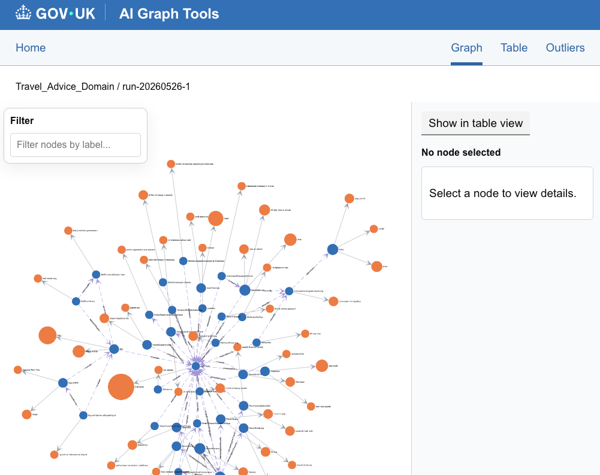
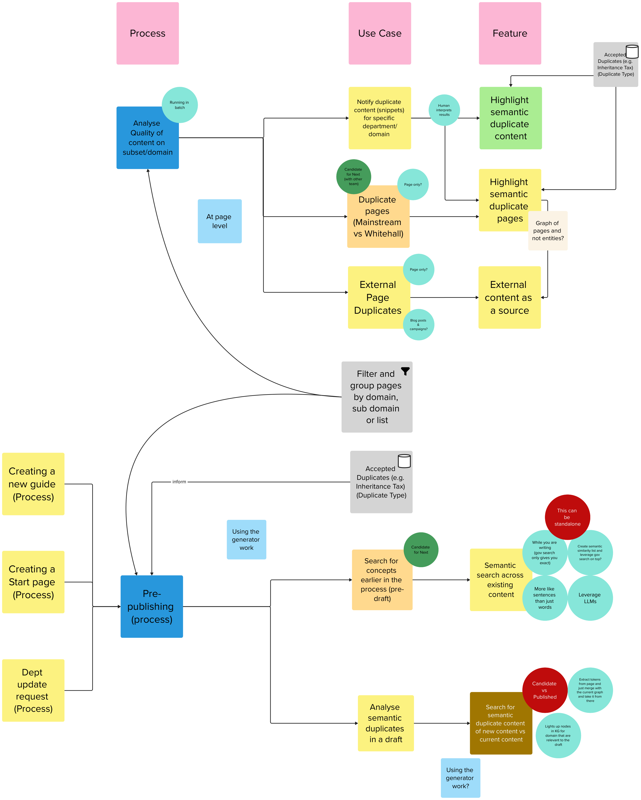
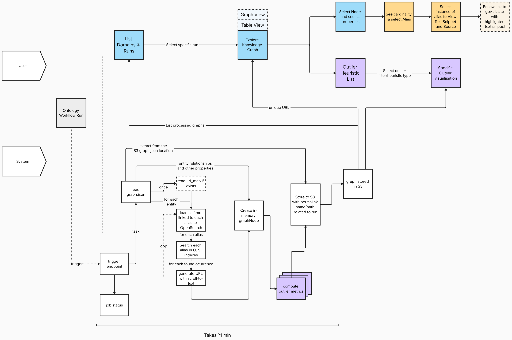

# GOV.UK AI Graph Tools

A proof-of-concept tool for identifying duplicate and outlier content across GOV.UK at scale. The tool uses semantic similarity and vector search (Amazon OpenSearch) to find content relationships and anomalies that would be impractical to detect through manual review.

Content is ingested from a knowledge graph built by the ontology generator, enabling content teams to prioritise quality improvements across large content estates. Outputs are shown through a graph visualiser with canonical node edges and alias search, designed for use by non-technical content professionals.

For a technical overview of how this graph tooling connects to the workflow app,
generator, harness, E2E testing framework, and research tooling, see the
[Ontology Generation Cross-Repo Integration overview](https://github.com/alphagov/govuk-ai-accelerator/blob/main/docs/architecture/cross-repo-integration.md).

The tool also includes outlier detection, which filters entities or aliases that look unusual compared to the rest, helping content teams identify errors, inconsistencies, or gaps. For now, outlier types include imbalanced terms (where some aliases for an entity are used significantly less often than others) and near-identical terms (aliases with very similar wording that may indicate a misspelling or inconsistent usage).

## Current Use Cases

The tool was developed as a PoC to help content designers at GDS identify content quality issues across GOV.UK without manual review.

**Semantic duplicate detection**
Finds content overlaps across a given GOV.UK domain. Validated with content designers against known duplicates in test datasets.

**Outlier detection**
Two outlier patterns are implemented:
- **Imbalanced terms**: aliases for the same entity that are used significantly less often than others, pointing to inconsistent terminology across GOV.UK.
- **Near-identical terms**: aliases that are syntactically very similar, which may indicate a misspelling or an opportunity to standardise.

**Knowledge graph exploration**
Content designers can browse entities, aliases, and their relationships through an interactive graph view or a filterable table view. Each alias links back to the source GOV.UK pages where it appears.

The tool works across any GOV.UK (sub)domain processed by the Ontology Generator with no reconfiguration needed. It flags possible issues but does not make decisions; content SMEs review and act on the findings.

## Future Use Cases

The above diagram maps how publishing processes could interact with the tool's use cases and features, organised across two core process contexts: analysing the quality of content on a subset or domain, and pre-publishing.

**Analyse quality of content on a subset or domain.** Running in batch at the page level, this process could support three use cases:

- **Notify duplicate content:** finds snippets of semantically similar content for a specific department or domain, with human interpretation of results. This could feed into features for highlighting semantic duplicate content at snippet level and flagging semantic duplicate pages.
- **Duplicate pages (Mainstream vs Whitehall):** identifies page-level duplication across publishing formats, with candidate flagging and potential use of a page-level graph rather than an entity-level one.
- **External page duplicates:** detects content duplicated from external sources, including blog posts and campaigns, and shows external content as a source.
A filter and group function could allow pages to be organised by domain, subdomain, or list, with accepted duplicates (for example, Inheritance Tax) stored by duplicate type to inform the model over time.

**Pre-publishing.** Informed by publishing processes such as creating a new guide, creating a start page, or handling a departmental update request, this context could enable two further use cases:

- **Search for concepts earlier in the process (pre-draft):** allows publishers to run semantic search across existing content before drafting, bringing up similar material earlier in the workflow. This capability could also work as a standalone feature.
- **Analyse semantic duplicates in a draft:** compares new content against currently published content to find duplicate concepts at draft stage, using token extraction and semantic similarity scoring.

## Possible Future Outlier Types

The following outlier types were identified during the PoC as candidates for future tools. Tone and readability and stale content were of particular interest to content SMEs.

- **Terminology outliers (semantic drift)**: the same concept expressed with different wording not currently captured as an alias in the ontology.
- **Structural outliers**: pages that do not follow the expected structure for their content type (for example, missing headings or no steps in a guide).
- **Tone and readability outliers**: content that deviates from the GOV.UK style guide in plain English, reading level, or tone.
- **Journey outliers**: pages that sit awkwardly in a user journey graph, with confusing terminology or missing backlinks.
- **Policy and fact inconsistencies**: conflicting factual information on or across pages (for example, "processing takes 5 days" vs "processing takes up to 10 days").
- **Stale content**: content that has not been updated in line with related pages.
- **Entity coverage gaps**: an entity mentioned frequently across GOV.UK that lacks a canonical page.
- **Near-duplicates**: content that is 70-90% similar but has diverged slightly, making it harder to detect and maintain.

# Technical Perspective

## Architecture

The tool is a Flask/Uvicorn web application deployed as a Docker container on AWS, built around four main layers.

**Ingestion and extraction**
A knowledge graph (JSON) maps entities to aliases and their source documents on S3. Two extraction strategies are available: an S3 sequential extractor (fetches and chunks documents directly) and an OpenSearch extractor (uses a pre-indexed vector search to retrieve targeted chunks). The OpenSearch extractor is used by default. Extracted chunks are sent to Anthropic Claude (via AWS Bedrock), which pulls relevant quotes directly from the source markdown files.

**Processing and storage**
Extraction runs as an async background job. Job status and output are persisted to S3. Once complete, the system generates a graph model (nodes, edges, and outlier metadata) saved as `graphNode.json`.

**Outlier detection**
Imbalanced aliases are found using z-score analysis of alias occurrence counts. Near-identical aliases are detected by edit distance (Levenshtein distance) scoring.

**Visualisation**
Results are served through a set of HTML/JS views: an interactive Cytoscape graph, a React-based metrics dashboard, and dedicated outlier views for similar and imbalanced aliases. The UI uses GOV.UK Design System CSS classes wherever possible.

**Key technologies:** Python 3.12, Flask, Uvicorn, AWS Bedrock (Claude Sonnet), Amazon OpenSearch, AWS S3, Cytoscape.js, Pydantic, uv.

## Available API endpoints

All endpoints use `GET`.

| Endpoint | Parameters | Description |
|---|---|---|
| `GET /extract` | `source_path` | Start an extraction job using the S3 extractor. |
| `GET /extract-os` | `source_path`, `index` | Start an extraction job using the OpenSearch extractor. Set `index=true` to re-index before extracting. |
| `GET /status/<job_id>` | - | Get the status of a background job. |
| `GET /visualisations` | - | Browse all available visualisation outputs. |
| `GET /graph` | `run_path` | Interactive Cytoscape graph for a given run. |
| `GET /graph-viewmodel` | `run_path` | Raw graph data as JSON. |
| `GET /metrics` | `run_path` | Metrics dashboard for a given run. |
| `GET /outliers` | `run_path` | Select an outlier type to explore. |
| `GET /outliers/similar-aliases` | `run_path` | Aliases syntactically similar to others for the same entity. |
| `GET /outliers/imbalanced-aliases` | `run_path` | Aliases that occur significantly less often than others for the same entity. |
| `GET /` | - | Redirects to `/visualisations`. |
| `GET /healthcheck/ready` | - | Returns `200 Application OK`. |

## Developer Setup & Operations

For detailed, step-by-step instructions on setting up your local environment, configuring secrets, running the test suites, launching CLI Makefile actions, and triggering ingestion pipelines, please refer to the [Developer Setup and Operations Runbook](file:///Users/ademolaadefioye/Desktop/GDS/content_extractor_s3/DEVELOPER_RUNBOOK.md).
